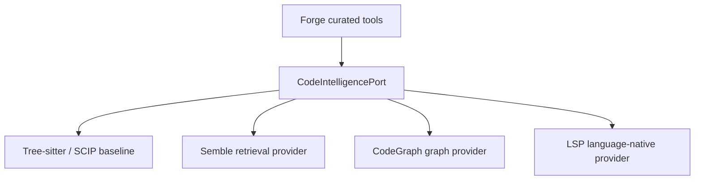

# Forge v1 Tooling Audit

**Ngày đánh giá:** 2026-07-16  
**Phạm vi:** toàn bộ 52 MCP tools thuộc namespace `forge_v1`, tập trung sâu vào `read`, `read_files`, `write_file`, `edit`, `apply_patch`, `search`, code intelligence, độ chính xác, an toàn, tốc độ engine, tốc độ end-to-end và chi phí context/token.

## Kết luận điều hành

Forge v1 có nền tảng kỹ thuật tốt, đặc biệt ở optimistic locking, snapshot binding, policy enforcement, bounded output, audit log, Git safety và các workflow shipping có verification gate. Phần lõi `read`, `write_file` và `edit` đã ở mức mạnh. Tuy nhiên, bộ tool hiện **chưa đạt chuẩn “elite/high-end” end-to-end** vì năm điểm nghẽn lớn:

1. **Tool surface quá rộng:** 52 tools tạo khoảng 45.4 KB JSON contract, xấp xỉ 11.3k tokens trước khi agent làm việc. Nhiều tool gần nhau làm tăng chi phí chọn tool và khả năng gọi sai.
2. **Output contract quá lỏng:** cả 52 output schemas đều là object mở (`additionalProperties: true`), nên agent không được biết chính xác shape, enum, nullability hay invariants của kết quả.
3. **`workspace_apply_patch` chưa đủ tin cậy:** trong 16 lần gần nhất có 8 thành công, 8 thất bại. Fail-closed là đúng, nhưng UX và chẩn đoán patch còn yếu. `workspace_edit` đáng tin cậy hơn nhiều và nên là mutation primitive mặc định.
4. **Engine nhanh nhưng đường đi end-to-end chậm:** `workspace_read_file` có p50 khoảng 0.69 ms và `workspace_search` p50 khoảng 26 ms ở server, trong khi một số lần gọi qua connector mất 1–18 giây. Chi phí nằm chủ yếu ở bootstrap/transport/payload/round-trip, không phải đọc file hay literal search.
5. **Verification mới là chi phí lớn:** dữ liệu field trong issue #37 cho thấy full profile từng chiếm phần lớn thời gian tool. Code intelligence phải ưu tiên affected-test candidates và tự đẩy chúng vào verification flow, không chỉ thêm các tool symbol-search thụ động.

Đánh giá tổng thể hiện tại: **7.6/10**. Với các hạng mục P0/P1 trong báo cáo này, Forge có đường đi thực tế đến mức 9/10.

| Trục | Điểm hiện tại | Nhận định |
| --- | ---: | --- |
| Safety và policy | 9.0 | Rất mạnh; fail-closed, allowlist, fingerprints, exact SHA, bounded execution |
| Core read/write | 8.7 | Nhanh, chính xác, bảo vệ tốt; batch/cursor còn cải thiện được |
| Mutation ergonomics | 7.0 | `edit` mạnh; `patch` có tỷ lệ thất bại thực tế cao |
| Search/retrieval | 7.2 | Literal search nhanh; thiếu regex, symbol, semantic, related-code và ranking |
| Verification workflow | 7.5 | Có nền tảng tốt nhưng full profile đắt; affected-test routing chưa có |
| Contract/tool design | 5.8 | 52 tools, generic outputs, bounds chưa thể hiện đầy đủ |
| End-to-end speed | 5.5 | Engine nhanh nhưng connector/payload/round-trip làm mất lợi thế |
| Observability | 8.2 | Audit tốt; cần phân lớp engine/connector/client và SLO rõ ràng |

## Phương pháp và giới hạn

Đánh giá dựa trên:

- inventory và frozen release contract của 52 tools tại commit RepoForge `2c456a2a13b7bb11f562ddf6cd21c278b3664985`;
- source và test coverage của các application use cases quan trọng;
- audit events gần đây theo từng action;
- thử nghiệm trực tiếp end-to-end qua connector Forge v1;
- live GitHub issues của RepoForge, CodeGraph và Semble;
- tài liệu chính thức của LSP, GitHub Copilot CLI và Microsoft `multilspy`.

Các số audit dưới đây là **field sample**, không phải benchmark lab kiểm soát hoàn toàn. Số end-to-end bị ảnh hưởng bởi concurrency, connector và tải bên ngoài. Benchmark vendor của CodeGraph/Semble được xem là tín hiệu tham khảo, không phải bằng chứng độc lập.

## Bức tranh hiệu năng thực tế

### Server-side audit

| Action | Calls | Success | p50 | p95 | Nhận định |
| --- | ---: | ---: | ---: | ---: | --- |
| `workspace_read_file` | 100 | 98% | 0.69 ms | 1.73 ms | Engine xuất sắc; 2 lỗi là `NOT_FOUND`, không phải lỗi hệ thống |
| `workspace_read_files` | 44 | 100% | 100.82 ms | 217.92 ms | Batch chậm hơn tổng raw reads do gọi nested use case/audit từng file |
| `workspace_search` | 100 | 100% | 26.14 ms | 52.03 ms | Literal search nhanh và ổn định |
| `workspace_write_file` | 63 | 100% | 164.16 ms | 231.36 ms | Full replacement đáng tin cậy |
| `workspace_edit` | 100 | 98% | 167.03 ms | 260.72 ms | Mutation primitive tốt nhất hiện tại |
| `workspace_apply_patch` | 16 | 50% | 111.53 ms | 1,603.11 ms | Điểm yếu rõ nhất; 8 lỗi parse/context/apply |
| `repo_search` | 57 | 100% | 104.94 ms | 233.60 ms | Snapshot-bound search tốt |

Những failure gần đây của `workspace_apply_patch` gồm `PATCH_APPLY_FAILED` (3), `PATCH_CONTEXT_AMBIGUOUS` (2), `PATCH_CONTEXT_NOT_FOUND` (1) và `PATCH_PARSE_FAILED` (2). Tool đã thử các repair như recount hunk, relocate hunk và chuyển OpenAI envelope nhưng vẫn fail-closed; cách xử lý an toàn là đúng, độ usable chưa đủ cao.

### End-to-end observation

- `repo_task_context`: server khoảng 74 ms, quan sát end-to-end khoảng 2.3 s. Đây là bằng chứng mạnh cho việc composite tool giúp giảm round-trip.
- Các `repo_search` chạy song song: server p50 khoảng 105–128 ms nhưng outer latency quan sát khoảng 12.9–18.5 s.
- `repo_list`: engine rất nhỏ nhưng outer call từng khoảng 12.5 s và payload bị lặp ở cả text lẫn structured content.
- Một `operation_list` trong bootstrap song song trả `UNAVAILABLE: Connection failed`, sau đó gọi lại thành công. Cần resilience/circuit metrics ở connector.

Kết luận: tối ưu thêm vài millisecond trong raw reader sẽ ít giá trị hơn giảm bootstrap, payload duplication, số round-trip và kích thước tool surface.

## Deep dive: read, write, edit, patch, search

### `workspace_read_file` và `repo_read_file`

Điểm mạnh:

- UTF-8 only, NUL/binary/symlink/path-policy protection;
- snapshot hoặc workspace identity rõ ràng;
- line numbering, SHA-256, truncation flag và output cap;
- `repo_read_file` đọc Git object immutable, không phụ thuộc source clone dirty;
- performance server-side dưới millisecond cho workspace read.

Điểm cần sửa:

- head+tail truncation có thể bỏ phần giữa của range mà agent vừa yêu cầu; cần trả `omitted_line_range`, `next_cursor` hoặc resume token;
- mọi min/max và pattern phải hiện ngay trong input schema;
- output schema phải typed, bao gồm `content`, `sha256`, `start_line`, `end_line`, `total_lines`, `truncated`, `next_cursor`;
- không để absolute host path xuất hiện trong output/audit trả về agent; chỉ dùng `repo_id`, `workspace_id` và relative path.

### `workspace_read_files` và `repo_read_files`

Điểm mạnh:

- dedupe, bounded batch, deterministic order;
- partial success có error riêng cho từng file;
- cùng safety envelope với single read.

Điểm cần sửa:

- API chỉ có một `start_line/end_line` dùng chung cho tất cả files;
- `workspace_read_files` gọi lại single-reader và audit từng file, làm p50 lên khoảng 100 ms dù raw read rất nhanh;
- output trung bình gần 44 KB, dễ làm context phình;
- nên chuyển sang `files: [{path, start_line, end_line}]`, thêm global byte/token budget, cursor, và chỉ ghi một batch audit event.

### `workspace_write_file`

Đây là full-file replacement tốt: expected SHA, create sentinel, atomic single-file write, size/NUL/symlink checks, preserve mode, lock, diff stat và fingerprint mới. 63/63 field calls gần đây thành công.

Cải thiện đề nghị:

- thay sentinel chuỗi `"<new>"` bằng `mode: "create_only" | "replace"` và typed precondition;
- trả `changed: false` khi no-op;
- bổ sung multi-file transaction hoặc hợp nhất vào `workspace_change`;
- exact output schema và stable error details.

### `workspace_edit`

Đây nên là mutation primitive mặc định. Tool hỗ trợ tối đa nhiều file, nhiều exact replacements, expected occurrences và expected SHA cho từng file; tất cả validation diễn ra in-memory trước khi write.

Một vấn đề contract quan trọng: implementation ghi atomic từng file theo thứ tự rồi best-effort rollback nếu I/O failure. Vì rollback errors bị suppress và không có filesystem transaction thực, mô tả “whole-call atomic” mạnh hơn đảm bảo thực tế khi crash hoặc mid-write I/O failure. Có hai lựa chọn đúng:

1. triển khai journal/temp transaction với fsync/rename và fault-injection tests; hoặc
2. đổi contract thành “validation-atomic, best-effort write rollback”.

Không nên giữ wording hiện tại mà thiếu test cho mid-write failure, rollback failure và process crash.

### `workspace_apply_patch`

Safety design tốt: exact head SHA, workspace fingerprint, lock, normalize patch, policy check, `git apply --check`, rollback và fingerprint verification. Tuy nhiên, unified diff là format dễ lỗi đối với LLM, và field success 50% là chưa chấp nhận được cho default high-end workflow.

Đề nghị:

- hạ `apply_patch` thành escape hatch;
- mặc định dùng typed `workspace_edit`/`workspace_write_file`;
- tạo `workspace_change` với typed ops: `replace_text`, `write`, `create`, `delete`, `move`;
- thêm `patch_preview` hoặc dry-run trả chính xác file/hunk/candidate context/digest và safe fallback;
- xây golden corpus từ patch do nhiều model tạo, property tests và fuzz tests;
- mục tiêu field success của typed change phải trên 99%; patch thuần phải trên 95% trên corpus được công bố.

Không nên dùng fuzzy apply không giới hạn vì tăng nguy cơ sửa nhầm code.

### `workspace_search` và `repo_search`

Literal search hiện tại nhanh, deterministic và policy-aware. Nhưng output match dạng chuỗi và feature set còn ở mức grep có kiểm soát.

Cần bổ sung theo lớp, không làm một search “ma thuật” không giải thích được:

1. exact literal/regex/file-name search;
2. symbol/definition/reference search;
3. semantic retrieval và related-code;
4. graph/impact/affected-test evidence;
5. coverage, confidence, provider, snapshot và limitations trong mọi kết quả.

Match phải là object typed (`path`, `line`, `column`, `match`, `context_before`, `context_after`, `score`, `provider`) thay vì string parsing. Thêm cursor, global budget, regex guard và ranking mode.

## Đánh giá 52/52 tools

Thang điểm: **A** = giữ làm public primitive; **B** = tốt nhưng cần hardening/UX; **C** = cần redesign hoặc chỉ dùng fallback. Dấu `+/-` cho biết vị trí trong band.

### Configuration, operations và audit

| Tool | Grade | Đánh giá | Hành động chính |
| --- | --- | --- | --- |
| `config_inspect` | B+ | Hữu ích cho generation/pending config; output có thể lộ host paths và khá verbose | Redact path, typed diff, compact summary |
| `operation_cancel` | A- | Cancel durable operation đúng abstraction; idempotent | Typed terminal states và cancellation reason |
| `operation_list` | B | Cần cho background work nhưng output lớn; một transient connector failure khi chạy song song | Cursor/filter/state enum, retry metadata, compact payload |
| `operation_status` | A- | Polling nhanh và rõ | Typed progress/result refs; adaptive polling hint |
| `runtime_logs_read` | B+ | Audit/redaction mạnh, rất hữu ích cho field evidence | Công bố bounds trong schema, cursor/time range, không trả absolute paths |

### Repository snapshot, GitHub evidence và policy

| Tool | Grade | Đánh giá | Hành động chính |
| --- | --- | --- | --- |
| `repo_commit_read` | A- | Snapshot commit evidence tốt, immutable | Typed files/truncation/cursor |
| `repo_compare` | A- | So sánh ref đúng closed-world use case | Output budget và structured file changes |
| `repo_context` | B+ | Context hữu ích nhưng overlap với `repo_task_context` | Giữ làm internal building block; ưu tiên composite tool |
| `repo_issue_graph` | C+ | Có thể trả empty-success khi graph chưa cấu hình, dễ bị hiểu là “không có issue” | Explicit `graph_unavailable`, next action và root/search mode |
| `repo_issue_next` | B | Hữu ích nếu graph đầy đủ; chất lượng phụ thuộc graph membership | Coverage/why-selected/blocked-state typed; schema bounds |
| `repo_issue_read` | B+ | Live/cache semantics tốt | Typed cache age/ETag/comment paging |
| `repo_issue_spec` | B | Composite evidence tốt nhưng không phát hiện stale body/spec khi issue không là graph member | Drift checks độc lập graph; explicit completeness reasons |
| `repo_list` | B- | Discovery cần thiết nhưng payload lớn, absolute path và repo details thừa cho agent | Chỉ trả IDs/capabilities/default refs; detail on demand |
| `repo_policy_apply` | B+ | Approval/policy workflow mạnh nhưng contract lớn nhất, nhiều nhánh | Tách preview/apply schema typed; dynamic exposure |
| `repo_pr_read` | B+ | PR evidence live/cache hợp lý | Typed review/check pagination và freshness |
| `repo_read_file` | A | Immutable, bounded, safe; core high-end primitive | Cursor/omitted range và exact output schema |
| `repo_read_files` | B+ | Batch giảm round-trip nhưng same-range và output lớn | Per-file ranges, global budget, cursor |
| `repo_recent_commits` | A- | Context lịch sử gọn và hữu ích | Cursor/time range và compact commit shape |
| `repo_search` | B+ | Nhanh, đúng snapshot, ổn định | Regex/file/symbol layers; structured matches; cursor |
| `repo_status` | B | Remote/GitHub status có giá trị nhưng chậm hơn local | Cache freshness, partial-source status và compact result |
| `repo_task_context` | A | Composite tool tốt nhất; giảm round-trip rõ rệt | Là default entry point; budget sections và evidence refs |
| `repo_tree` | B+ | Bounded tree snapshot tốt | Cursor/subtree mode và explicit omitted counts |

### Workspace lifecycle, read, mutation và status

| Tool | Grade | Đánh giá | Hành động chính |
| --- | --- | --- | --- |
| `workspace_apply_patch` | C | Safety tốt nhưng field success chỉ 50% | Escape hatch; typed change API; rich dry-run diagnostics |
| `workspace_base_status` | B | Cần cho base divergence nhưng phụ thuộc remote/Git latency | Cache/ref freshness và background mode |
| `workspace_commit` | B+ | Exact verification gate trước commit là điểm mạnh | Typed gate failures và result refs |
| `workspace_create` | B+ | Lifecycle/branch/worktree abstraction đúng | Stronger idempotency key và typed source/base info |
| `workspace_diff` | A- | Core inspection primitive, non-mutating | Structured hunks/file stats và cursor/budget |
| `workspace_edit` | A- | Mutation primitive mạnh nhất, 98% field success | Sửa atomicity contract/implementation; exact output schema |
| `workspace_format_changed` | B+ | Policy-derived formatting tốt, giảm arbitrary command | Per-formatter evidence, no-op status và changed-file budget |
| `workspace_hygiene_status` | B | Hữu ích nhưng có thể chậm/verbose | Incremental cache, concise violations, details on demand |
| `workspace_list` | C+ | 37 records nhưng chỉ 19 tồn tại trong sample; stale records làm payload lớn | Default `exists=true`, lifecycle filter, paging/archive/cleanup hint |
| `workspace_read_file` | A | Server-side cực nhanh, safe và content-addressed | Cursor/omitted range; typed output |
| `workspace_read_files` | B | Batch đúng hướng nhưng nested auditing và 44 KB average payload | Per-file ranges, one audit event, global budget |
| `workspace_refresh` | B+ | Preview + exact token và không rebase là safety tốt | Background option và conflict evidence typed |
| `workspace_refresh_preview` | A- | Read-only planning trước mutation rất đúng | Stable plan hash và exact apply precondition |
| `workspace_remove` | B+ | Chỉ remove clean local workspace, guard tốt | Recoverability window/tombstone và explicit remote untouched |
| `workspace_restore_paths` | B+ | Destructive nhưng scoped và fingerprint-bound | Preview mode và per-path result |
| `workspace_search` | B+ | Literal search nhanh, 100% sample success | Structured matches, cursor, regex/file/symbol modes |
| `workspace_status` | B | Accurate nhưng fingerprint scan khoảng 0.85 s trong sample | Incremental fingerprint/cache; mutation trả token để tránh gọi lại |
| `workspace_tree` | B+ | Safe bounded working-tree navigation | Cursor/subtree and omitted counts |
| `workspace_write_file` | A- | 63/63 field success, strong optimistic locking | Typed create/replace mode, multi-file transaction/no-op |

### Verification and diagnostics

| Tool | Grade | Đánh giá | Hành động chính |
| --- | --- | --- | --- |
| `workspace_run_adhoc` | B- | Escape hatch cần thiết nhưng làm surface phức tạp; policy vẫn bounded | Dynamic exposure, explicit risk tier, argv templates, strict output cap |
| `workspace_run_diagnostic` | A- | Typed targeted runner có giá trị cao; adoption từng thấp | Tự route affected-test candidates vào selector; one-click next action |
| `workspace_run_profile` | B | Durable/profile-based tốt nhưng là nguồn latency lớn và nhiều failed runs | Quick/targeted first, affected-test routing, early failure evidence |

### PR, push và shipping

| Tool | Grade | Đánh giá | Hành động chính |
| --- | --- | --- | --- |
| `workspace_create_draft_pr` | B+ | External mutation có exact workspace scope và idempotency | Typed remote state/conflict/retry semantics |
| `workspace_pr_check_details` | B+ | Drill-down cần thiết sau check failure | Compact annotations, cursor và provider freshness |
| `workspace_pr_checks` | B+ | Bounded check overview tốt | Normalize provider states và recommended next evidence |
| `workspace_pr_failure_evidence` | A- | Bounded/redacted failure packet rất hợp agent | Link affected tests/code impact; exact provenance |
| `workspace_pr_status` | B+ | Unified PR status hữu ích | Delta-since token để giảm payload |
| `workspace_pr_watch` | A- | Durable exact-SHA watch là thiết kế tốt | Event cursor, adaptive interval và terminal reason |
| `workspace_push` | A- | Non-force, allowlisted remote, exact verification gate | Typed rejection/retry, lease/remote-head evidence |
| `workspace_update_draft_pr` | B+ | Scoped external update đúng workflow | Patch semantics cho title/body, idempotency and remote version |

**Kiểm đếm:** 5 configuration/operation/audit + 17 repository + 19 workspace lifecycle/read/mutation + 3 verification + 8 shipping = **52 tools**.

## Contract và surface design

### Vấn đề schema

- Cả 52 output schemas đều là object mở, làm mất khả năng validation và tool-use planning ở phía model.
- 50/52 tools có ít nhất một string không thể hiện đầy đủ enum/pattern/max length ở discovery schema.
- Có ít nhất 25 integer parameters thiếu min/max đầy đủ trong frozen schema. Một ví dụ thực tế: `runtime_logs_read(limit=500)` bị server từ chối vì max là 200, nhưng giới hạn này không được model thấy rõ trong declaration.
- Kết quả connector thường chứa full JSON lặp ở cả `content.text` và `structuredContent`; đây có thể là interaction giữa FastMCP/client, nhưng end-to-end effect là context duplication.

### Thiết kế đề nghị

Không xóa capability. Hãy giảm **default-exposed surface** xuống khoảng 12–16 tools theo stage và bật tool chi tiết khi cần:

- Discover: `repo_task_context`, `repo_read_file(s)`, `repo_search`, `repo_tree`, issue/PR evidence composite.
- Change: `workspace_read_file(s)`, `workspace_search`, `workspace_change`, `workspace_diff`, `workspace_status`.
- Verify: một `workspace_verify` composite chọn diagnostic/quick/full dựa trên impact.
- Ship: một shipping context plus explicit `commit`, `push`, `draft_pr`, `watch` actions.
- Advanced/fallback: raw patch, adhoc run, low-level graph, detailed PR tools được lazy-enable.

CodeGraph cũng mặc định expose một `codegraph_explore` mạnh thay vì hàng loạt narrow tools; đó là tín hiệu thiết kế đáng học, nhưng Forge vẫn cần giữ typed safety boundaries riêng.

## CodeGraph, Semble và LSP

### Kết luận: dùng cả ba, nhưng sau một port chung



Không expose MCP native của ba provider trực tiếp cho agent. Forge phải sở hữu auth, path policy, snapshot identity, quotas, cancellation, output budget, evidence normalization và fallback.

| Provider | Công việc phù hợp nhất | Điểm mạnh | Rủi ro/giới hạn | Quyết định |
| --- | --- | --- | --- | --- |
| Tree-sitter/SCIP | Baseline snapshot facts | Deterministic, provider-neutral, dễ canary | Depth không bằng compiler/LSP | Bắt buộc baseline |
| Semble | Natural-language search, related-code, behavior discovery | Hybrid BM25 + static embeddings, CPU, rất nhanh theo vendor | Full rebuild khi file thay đổi; young; benchmark vendor-controlled | Optional retrieval provider |
| CodeGraph | Callers/callees, flows, blast radius, impact, affected tests | Graph context mạnh, local, broad language support | Open precision/indexing/output issues; index lifecycle | Optional sidecar + canaries |
| LSP | Definition/reference/type/diagnostics trên dirty workspace | Language-native precision, structured compact results | Stateful, startup/config/build cost, capabilities không đồng đều | Optional read-only provider đầu tiên |

### CodeGraph

[CodeGraph](https://github.com/colbymchenry/codegraph) là lựa chọn đáng thử nhất cho graph/flow/impact. Mặc định nó cung cấp một `codegraph_explore` tổng hợp source, call path và blast radius; hidden tools vẫn tồn tại cho node/search/callers/callees/impact/status. Đây phù hợp với mục tiêu giảm tool sprawl của Forge.

Nhưng không nên đưa vào critical path ngay. [Open issue tracker](https://github.com/colbymchenry/codegraph/issues) hiện có các lỗi liên quan đến TypeScript imported singleton call resolution, C++ qualified names/templates, directory deletion không cascade, thiếu byte budget, thiếu structured JSON và việc agent không gọi tool. [Release v1.4.1](https://github.com/colbymchenry/codegraph/releases/tag/v1.4.1) cho thấy dự án phát triển nhanh, đồng thời nhắc rằng version/integrity pin và canary là bắt buộc.

Đề nghị cho Forge:

- chạy như managed sidecar, không ghi `.codegraph/` vào workspace;
- pin version + artifact digest + SBOM/provenance;
- tắt telemetry/update checks;
- bounded CPU/RAM/time/disk, cancel/dispose/orphan cleanup;
- canary multilingual cho edge, callers, impact, flow, deleted-file invalidation và nondeterminism;
- provider failure phải fallback về Tree-sitter/SCIP/path evidence;
- output luôn ghi provider/version/snapshot/coverage/limitations/confidence.

### Semble

[Semble](https://github.com/MinishLab/semble) là một code-search library mới, thiết kế cho agents. Nó chunk bằng tree-sitter, kết hợp static Model2Vec embedding `potion-code-16M` với BM25, fuse bằng Reciprocal Rank Fusion rồi rerank bằng definition/identifier/file/noise signals. Vendor công bố khoảng 250 ms index, 1.5 ms query và NDCG@10 0.854; đây là tín hiệu tốt nhưng phải benchmark lại trên corpus của Forge.

Semble giải quyết semantic retrieval, không giải quyết graph truth hay compiler precision. Index cache trên disk; khi bất kỳ file/settings thay đổi, CLI path hiện full rebuild, còn MCP watcher trigger rebuild. [Open issues](https://github.com/MinishLab/semble/issues) gồm silent degradation khi grammar download thất bại, install treo/high CPU, macOS x86 indexing failure và đề nghị exact version pin.

Đề nghị:

- adapter Python trực tiếp hoặc managed process, không expose native MCP/path argument;
- cache dưới private Forge index root, không trong repo;
- Forge deny policy phải override `.gitignore`/`.sembleignore`;
- return exact snippets kèm lexical/semantic score breakdown, snapshot digest và coverage;
- canary grammar availability và fail loudly, không silently degrade;
- A/B benchmark trên câu hỏi thật: recall@k, NDCG@10, tokens-to-answer, time-to-first-relevant-snippet.

### LSP

[LSP 3.18](https://microsoft.github.io/language-server-protocol/) chuẩn hóa definition, references, symbols, hover, diagnostics, call hierarchy và nhiều language-native facts. [GitHub Copilot CLI documentation](https://docs.github.com/en/copilot/concepts/agents/copilot-cli/lsp-servers) cũng nêu lợi ích về accuracy, token efficiency và near-instant warm responses. [Microsoft multilspy](https://github.com/microsoft/multilspy) là reference client Python hỗ trợ Java, Python, Rust, C#, TypeScript/JavaScript, Go, Dart, Ruby, Kotlin, PHP và C++.

LSP nên được thêm, nhưng giai đoạn đầu chỉ expose read-only facts:

- definition, references, implementation, document/workspace symbols;
- hover/type signature;
- diagnostics delta;
- incoming/outgoing calls nếu server hỗ trợ;
- capability/coverage/partial result rõ ràng.

Chưa nên expose rename/code action trực tiếp. Các mutation này phải đi qua preview, normalized edits, Forge policy, optimistic lock và diff verification. Cũng không nên để `multilspy` tự tải binary tùy ý; mọi language server cần reviewed manifest, version/digest pin, license/provenance, resource limit và project trust gate.

### Provider fusion đề nghị

Một query không nên “chọn người thắng” bí mật. Forge nên trả evidence hợp nhất nhưng truy vết được:

```json
{
  "snapshot": "repo/workspace identity + digest",
  "query": {"kind": "affected_tests", "selector": "..."},
  "evidence": [
    {"provider": "lsp", "confidence": 0.97, "paths": [], "limitations": []},
    {"provider": "codegraph", "confidence": 0.82, "paths": [], "limitations": []},
    {"provider": "semble", "confidence": 0.63, "paths": [], "limitations": []}
  ],
  "coverage": {"languages": [], "files_indexed": 0, "files_skipped": 0},
  "safe_next_action": {"tool": "workspace_run_diagnostic", "selector": {}}
}
```

Confidence phải được calibration bằng corpus/canary, không tự gán tùy ý. Không provider nào được dùng làm authorization hoặc để bỏ qua required tests.

## Trạng thái issues RepoForge liên quan

- [#35](https://github.com/maemreyo/repoforge/issues/35): initiative cho shared evidence/code intelligence/architecture drift, đang mở.
- [#37](https://github.com/maemreyo/repoforge/issues/37): provider-neutral code intelligence baseline, đang mở và body còn ghi blocked bởi #5/#36.
- [#38](https://github.com/maemreyo/repoforge/issues/38): optional graph-provider sidecar/canaries, đúng vị trí để thử CodeGraph/RepoGraph.

#5 và #36 hiện đều đã đóng, nên #37 thực tế có thể được unblocked. `repo_issue_spec` vẫn báo `graph_member: false`, `evidence_complete: false`, `drift: []`; điều này cho thấy drift detector hiện bỏ sót stale blocker/status metadata khi ticket không thuộc configured graph. Cần sửa issue metadata trước khi triển khai và làm drift detection độc lập với graph membership.

Addendum của #37 đã xác định đúng ưu tiên: affected-test candidates phải được đẩy vào failed profile/recommendations và đo bằng tỷ lệ targeted runs, full-profile share và failed-verification duration.

## Roadmap ưu tiên

### P0 — contract, correctness và end-to-end efficiency

1. **Typed output schemas cho 52 tools:** no generic object; enum/bounds/pattern/nullability/error union đầy đủ; contract tests và backward-compatibility review.
2. **Giảm default tool surface:** stage-scoped/lazy tools; dùng `repo_task_context` làm mẫu composite; đo tool-selection accuracy và prompt tokens.
3. **Redesign mutation:** `workspace_change` typed transaction; `apply_patch` thành fallback; rich dry-run diagnostics.
4. **Chốt atomicity:** filesystem transaction thật hoặc sửa wording của `workspace_edit`; thêm I/O/crash fault-injection tests.
5. **Tối ưu connector/payload:** loại full JSON duplication, compact summary + structured content/resource refs, compression và end-to-end tracing.
6. **Dọn workspace discovery:** filter active/existing mặc định, cursor và archive/cleanup stale records.
7. **Không lộ host paths:** redact ở repo/config/audit outputs; contract test bảo đảm chỉ dùng IDs và relative paths.

### P1 — code intelligence có tác động trực tiếp

1. Unblock và cập nhật #37; triển khai `CodeIntelligencePort` với Tree-sitter/SCIP baseline.
2. Trả affected-test candidates ở format dùng trực tiếp cho `workspace_run_diagnostic`.
3. Tự đưa cheaper next action vào failed `workspace_run_profile`/PR failure evidence.
4. Thử CodeGraph dưới #38 như optional managed sidecar với multilingual canaries.
5. Thử Semble như optional semantic/related-code provider; benchmark nội bộ, không tin vendor metrics mặc định.
6. Thêm LSP read-only provider cho ngôn ngữ ưu tiên; warm process, capability negotiation, reviewed binary manifests.

### P2 — polish và benchmark discipline

1. Per-file ranges, cursor và byte/token budgets cho read/tree/search/diff.
2. Structured search matches, regex/file-name modes và provider-attributed ranking.
3. One batch audit event cho `read_files`; bỏ nested overhead.
4. Delta tokens cho status/PR/watch để giảm payload lặp.
5. Xây public benchmark harness và release gates.

## Release gates đề nghị

| Gate | Mục tiêu ban đầu |
| --- | --- |
| Tool schema | 100% tools có typed output; 100% numeric/string bounds được công bố |
| Read accuracy | Golden corpus 100%; truncation luôn có resume metadata |
| Typed mutation | >99% success trên valid generated-change corpus; 0 wrong-target apply |
| Unified patch | >95% valid corpus success hoặc tiếp tục là fallback-only |
| Search | 100% policy/path isolation; p95 engine <100 ms literal trên reference repos |
| Semantic retrieval | Internal NDCG@10/recall@k và tokens-to-answer tốt hơn literal-only, theo từng language |
| Graph | Canary edge/impact precision/recall công bố; stale/deletion cases bắt buộc pass |
| LSP | Warm p95 và cold-start SLO theo server; explicit unsupported/partial coverage |
| Verification | Targeted-run adoption tăng; full-profile share và failed duration giảm có ý nghĩa |
| End-to-end | Tách SLO engine, connector và client; không dùng server latency để che outer latency |
| Payload | Không duplicate full result; p95 response bytes/token budget theo tool class |
| Privacy | Zero absolute host path/provider argv/socket leakage trong public results |

## Quyết định cuối cùng

- **Giữ và nâng cấp:** core read/write/edit, snapshot inspection, task context, diff, diagnostic, PR failure evidence, exact-SHA shipping.
- **Redesign ngay:** output schemas, tool exposure, `workspace_apply_patch`, workspace listing, connector payload và path redaction.
- **Đầu tư code intelligence:** có, nhưng ưu tiên affected tests/verification routing hơn symbol-search latency.
- **CodeGraph:** thử nghiệm có kiểm soát sau port chung, không direct MCP, không critical dependency.
- **Semble:** dùng cho semantic retrieval/related code, không dùng làm graph truth hay authorization.
- **LSP:** nên có; bắt đầu read-only, language-specific, warm managed sidecar, binary pinning nghiêm ngặt.

Forge không thiếu capability. Bước nhảy lên “high-end” đến từ **ít tool hơn nhưng sâu hơn, contract typed, evidence truy vết được, mutation transaction đáng tin, provider fusion có coverage và verification được dẫn đường bằng impact**.
